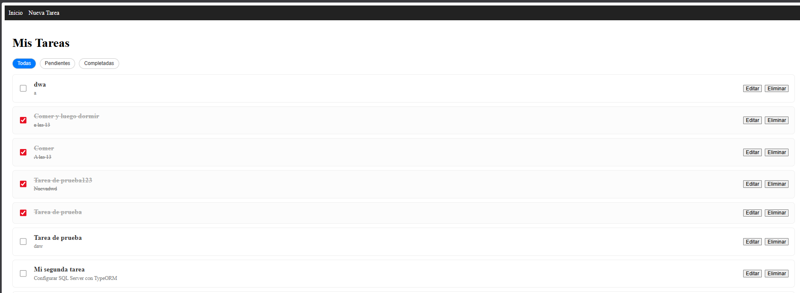
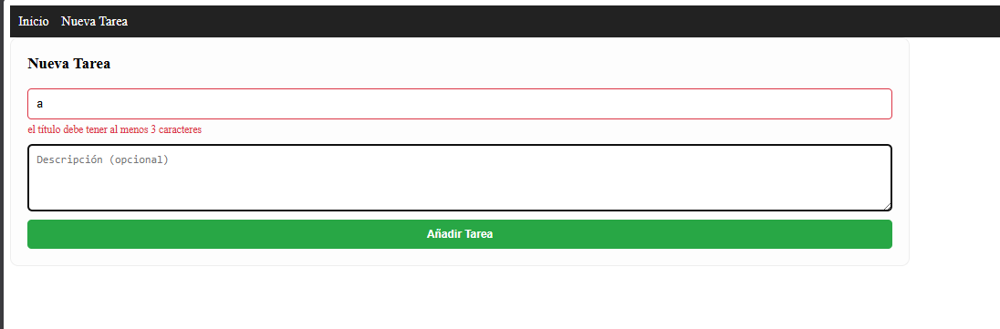
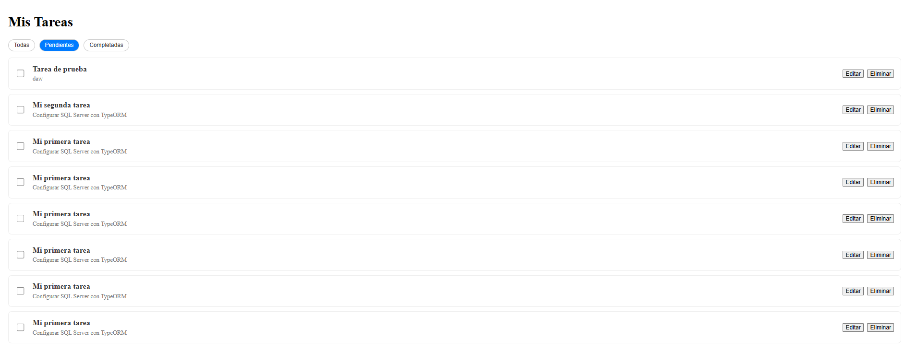
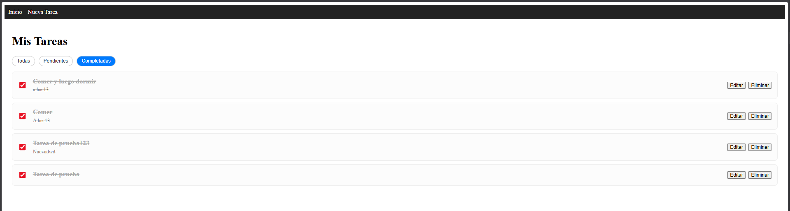
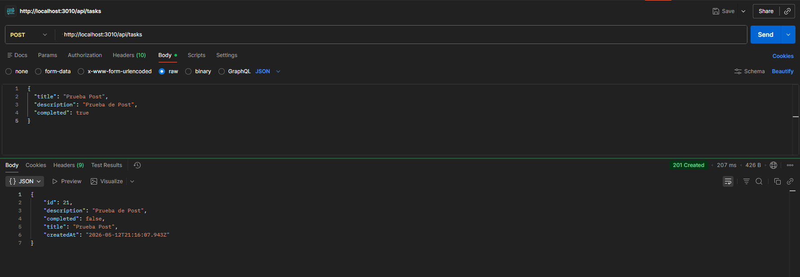
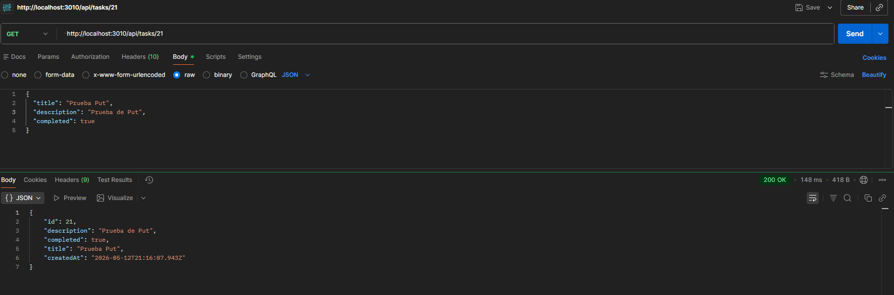
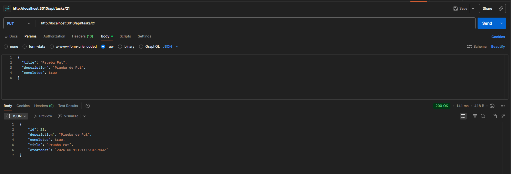
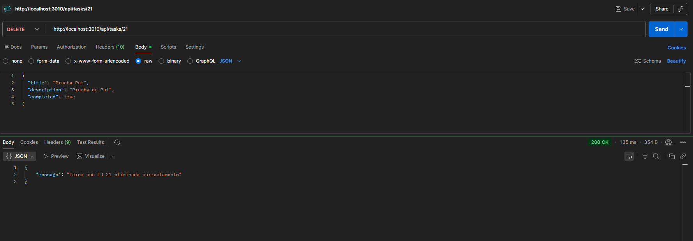

# 📝 Task Manager - Challenge Academia ForIT 2025

¡Bienvenido! Este proyecto es una aplicación Full Stack de gestión de tareas desarrollada como parte del proceso de ingreso para la Academia ForIT. La aplicación permite realizar todas las operaciones CRUD (Crear, Leer, Actualizar y Eliminar) con una arquitectura moderna y escalable.

---

## 🚀 Características y Tecnologías

El proyecto fue construido utilizando un stack robusto para asegurar el rendimiento y la integridad de los datos:

- **Frontend:**
  - **React** con **Vite** para una experiencia de desarrollo ágil.
  - **TypeScript** para un tipado estricto y código más seguro.
  - **React Router** para la navegación entre componentes.
  - **Fetch API** nativa para la comunicación con el servidor.
  - **CSS3** para un diseño limpio.

- **Backend:**
  - **Node.js** & **Express** para el servidor API.
  - **SQL Server** para la persistencia real de datos (superando el requisito de array en memoria).
  - **CORS** para la conexión segura entre frontend y backend.
  - **Dotenv** para la gestión de variables de entorno.

---

## ✨ Bonus Implementados

Para este desafío, decidí ir un paso más allá de los requerimientos básicos e incluir:
- [x] **Persistencia en Base de Datos:** Uso de SQL Server para mantener las tareas guardadas de forma permanente.
- [x] **TypeScript:** Implementación total en el frontend para evitar errores en tiempo de ejecución.
- [x] **Filtros Dinámicos:** Funcionalidad para filtrar tareas por estado (Todas, Pendientes, Completadas) sin recargar la página.
- [x] **Validación de Formularios:** Control de errores visual en tiempo real para asegurar que no se envíen tareas vacías.

---

## 📸 Screenshots y Evidencia Técnica

### 🌐 Interfaz de Usuario (Frontend)

Para el desarrollo del frontend se utilizó **React con TypeScript**, implementando una arquitectura de componentes reutilizables y navegación mediante **React Router**.

| Vista de Inicio | Validación de Formulario |
| :---: | :---: |
|  |  |
| *Dashboard principal con carga dinámica de tareas mediante Fetch API.* | *Manejo de errores: se impide el envío si el título no cumple con la validación de longitud mínima.* |

| Filtro: Pendientes | Filtro: Completadas |
| :---: | :---: |
|  |  |
| *Uso de estado derivado en React para filtrar tareas con `completed: false`.* | *Renderizado de tareas finalizadas con `completed: true` sin peticiones adicionales al servidor.* |

---

### ⚙️ Endpoints y Lógica de Servidor (Backend)

El backend, desarrollado en **Node.js y Express**, gestiona la lógica de negocio y la persistencia en **SQL Server**. A continuación, se detallan las pruebas de los endpoints principales:

*   **POST /api/tasks (Creación):**
    
    *Lógica de Integridad: El servidor está programado para asignar automáticamente `completed: false` a cualquier tarea nueva, garantizando que el flujo de trabajo comience correctamente sin importar los datos enviados por el cliente.*

*   **GET /api/tasks/:id (Búsqueda por ID):**
    
    *Recuperación específica de registros para alimentar el flujo de edición en el frontend.*

*   **PUT /api/tasks/:id (Actualización):**
    
    *Actualización de campos y estados con persistencia inmediata en la base de datos relacional.*

*   **DELETE /api/tasks/:id (Eliminación):**
    
    *Remoción física del registro en SQL Server mediante su identificador único.*

---

## 🛠️ Instalación y Configuración

Sigue estos pasos para ejecutar la aplicación localmente:

### 1. Clonar el repositorio
```bash
git clone [https://github.com/lucianocopa45/challenge-forIt-2026.git]
cd CHALLENGEFORIT